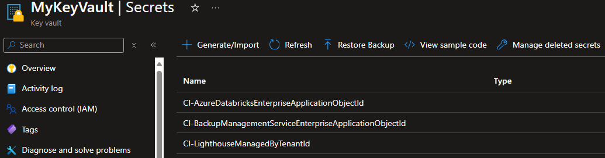
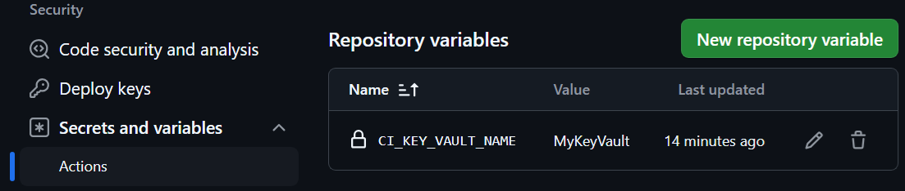

When working on a module, and more specifically its e2e deployment validation test cases, it may be necessary to leverage tenant-specific information such as
- Entra-ID-provided Enterprise Application object ids (e.g., Backup Management Service, Azure Databricks, etc.)
- (sensitive) principal credentials (e.g., a custom service principal's application id and secret)

The challenge with the former is that the value would be different from the contributor's test tenant compared to the Upstream AVM one. This requires the contributor to temporarily change the value to their own tenant's value during the contribution's creation & testing, and for the reviewer to make sure the value is changed back before merging a PR in.
The challenge with the later is more critical as it would require the contributor to store sensitive information in source control and as such publish it.

To mitigate this challenge, the AVM CI provides you with the feature to store any such information in a custom Azure Key Vault and automatically pass it into your test cases in a dynamic & secure way.

---

### _Navigation_

- [Example](#example)
- [Pre-Requisites](#pre-requisites)
- [Setup](#setup)
- [Background: Why not simply use GitHub secrets?](#background-why-not-simply-use-github-secrets)

---

# Example

# Pre-Requisites

# Setup

# Background: Why not simply use GitHub secrets?