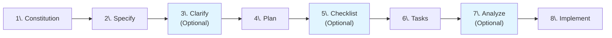

{}

The content in this section represents **experimental explorations** of emerging technologies and innovative approaches. To learn more about our experimental content and its implications, please refer to the [Experimental Section Overview]({}/experimental).

{}

## Prerequisites

{}

- [Spec Kit](https://github.com/github/Spec-Kit)

Before you begin, make sure you have these tools installed in your development environment!


## Solution Architecture

Before we begin coding, it is important to have details about what the infrastructure architecture will include. For our example, using AVM modules, we will be building a solution that will host a simple application on a Windows virtual machine (VM). The solution must be secure and auditable. The VM must not be accessible from the internet and its logs should be easily accessible. All Azure services should utilize logging tools for auditing purposes.


## Bootstrapping

{}

On a Windows PC, to get the **uv package manager CLI** tool required for locally installing the **Specify CLI**, run the following command:

`winget install astral-sh.uv`

{}

1. To install Spec Kit locally, run the following command:

```bash
uv tool install specify-cli --from git+https://github.com/github/spec-kit.git
```

2. Create a new directory for your Spec Kit project and navigate into it:

```bash
mkdir avm-bicep-spec-kit
cd avm-bicep-spec-kit
```

3. Initialize a new Spec Kit project:

```bash
specify init .
```

4. The rest of the steps will be performed using GitHub Copilot Chat in VS Code: Start your VS Code environment, open or add the newly created folder to your workspace, and navigate to GitHub Copilot Chat using the dialog icon on the top of the window or by hitting `CTRL+ALT+I`.

## Making it real

Spec Kit follows a structured workflow that guides you through each phase of solution development, from establishing foundational principles to implementing the final code. To learn more about Spec Kit, see the [Spec Kit overview]({}/experimental/ai-assisted-sol-dev/spec-kit) section.



To implement our example solution using Bicep and AVM modules, we will walk through each of these steps in details.

{}

Changing the LLM does make a difference. We highly encourage you test different models to see which one works best for your needs.

Note: At the time of writing this article, we tested our prompts with Claude Sonnet 4.5.

{}

### 1. Constitution

Spec Kit uses `/speckit.constitution` to generate the `constitution.md` file. The constitution can be evolved through iterating over the `constitution.md` file by either manually editing it or repeatedly fine tuning the prompt used with `/speckit.constitution`.

{}

To learn more about what the constitution should include, see the [related chapter]({}/experimental/ai-assisted-sol-dev/spec-kit#1-constitution) in the Spec Kit article.

{}

Run the following prompt to generate the constitution for our example:

```markdown
/speckit.constitution Fill the constitution with the typical requirements of a legacy Azure workload (needed to be retained for compliance reasons; no high-availability requirements; no disaster recovery requirements; no scalability requirements), defined as infrastructure-as-code, in Bicep language, built only with Azure Verified Modules (AVM). Always try to implement every feature with Bicep first (using Infra-as-code), and only use custom scripts when it's not possible otherwise. Follow IaC best practices: define everything in a single template, and let ARM manage dependencies and the order of deployment for each Azure resource.

Security and reliability best practices must be followed under all circumstances.

The naming convention is to use just enough random characters to make the name unique and have the Azure resource type reflected in the name. Resource type specific character and length limitations must be respected.

Before running a deployment, always run a validation.

Deploy everything to the US West 3 datacenter region.
```

### 2. Specify

Spec Kit uses `/speckit.specify` to generate the `spec.md` file. Specifications can be evolved through iterating over the `spec.md` file by either manually editing it or repeatedly fine tuning the prompt used with `/speckit.specify` and leveraging `/speckit.clarify` to review and challenge the specification.

{}

To learn more about what the specification should include, see the [related chapter]({}/experimental/ai-assisted-sol-dev/spec-kit#2-specify) in the Spec Kit article.

{}

Run the following prompt to generate the specification for our example:

```markdown
/speckit.specify Create specification, called "01-my-legacy-workload" for a legacy business application, running as a single virtual machine connected to a virtual network. The VM must run Windows Server 2016, needs to have at least 2 CPU cores, 8 GB of RAM, standard HDD and a 500 GB HDD-based data disk attached. It must be remotely accessible via a bastion host and needs to have access to an HDD-backed file share in a storage account connected via a private endpoint. The VM's administrator password (created at the time of deployment) must be stored in a Key Vault, also deployed as part of this solution.

Always only rely on parameters from the main.bicepparam file. Have the name of the secret used for the admin password captured as a parameter.

When a decision needs to be made on availability zones, always choose a number between 1 and 3 (never choose -1, that explicitly disables this feature).

Create everything in a single resource group, standing for a production environment.

Read the documentation (readme.md file) of each module you need to use to find out what parameters, and complex parameter objects you can use. Don't guess the allowed parameters.
```

### 3. Clarify (Optional)

Spec Kit uses `/speckit.clarify` to generate adjust information captured in `spec.md`. The prompt doesn't require any specific inputs as it analyzes the existing specification for gaps.

{}

To learn more about the clarify step, see the [related chapter]({}/experimental/ai-assisted-sol-dev/spec-kit#3-clarify-optional) in the Spec Kit article.

{}

Run the following prompt to generate clarification questions for our example:

```markdown
/speckit.clarify
```

### 4. Plan

Spec Kit uses `/speckit.plan` to generate the `plan.md` file. The plan can be evolved through iterating over the `plan.md` file by either manually editing it or repeatedly fine tuning the prompt used with `/speckit.plan`, or leveraging `/speckit.checklist` to review/validate and challenge the plan.

{}

To learn more about what the plan should include, see the [related chapter]({}/experimental/ai-assisted-sol-dev/spec-kit#4-plan) in the Spec Kit article.

{}

Run the following prompt to generate the plan for our example:

```markdown
/speckit.plan Create a detailed plan for the spec. Build with the latest version of Bicep and the latest available version of each AVM module. Only include direct resource references in the Bicep template if no related AVM resource modules are available. Do not create and reference local modules, or any other bicep files. If a subset of the deployments fail, don't delete anything, just attempt redeploying the whole solution after fixing any bugs. Create a single main.bicep file, with direct references to AVM modules and leverage a single *.bicepparam file for all input parameters.

When generating the admin password for the VM, use the secret feature built into the AVM Key Vault module. Leverage the uniqueString function to generate a new random password and do not use any external helper script (including deployment scripts) for generating the password. Provide this password to the VM module by referencing the Key vault secret that stores it. The template must first generate this password including a random, complex string, using the uniqueString Bicep function, store it in Key Vault and then reference it for the VM to use it as admin password at deployment time.

Don't connect the file share to the VM just yet - i.e., no need to extract storage keys or shared access signatures - we'll do this later.
```

### 5.Checklist (Optional)

Spec Kit uses `/speckit.checklist` to validate the requirements. The prompt doesn't require any specific inputs as it analyzes the existing plan for gaps.

{}

To learn more about the checklist step, see the [related chapter]({}/experimental/ai-assisted-sol-dev/spec-kit#5-checklist-optional) in the Spec Kit article.

{}

Run the following prompt to generate checklist items for our example:

```markdown
/speckit.checklist
```

### 6. Tasks

Spec Kit uses `/speckit.tasks` to generate the `tasks.md` file. The prompt doesn't require any specific inputs as it analyzes the existing plan to break it down into actionable tasks. Tasks can be evolved through iterating over the `tasks.md` file by either manually editing it or repeatedly fine tuning the prompt used with `/speckit.tasks`, or leveraging `/speckit.analyze` to review/validate and challenge the tasks.

{}

To learn more about what the tasks should include, see the [related chapter]({}/experimental/ai-assisted-sol-dev/spec-kit#6-tasks) in the Spec Kit article.

{}

Run the following prompt to generate tasks for our example:

```markdown
/speckit.tasks
```

### 7. Analyze (Optional)

Spec Kit uses `/speckit.analyze` to generate an analysis report. The prompt doesn't require any specific inputs as it analyzes the existing spec, plan and tasks to produce the report.

{}

To learn more about the analyze step, see the [related chapter]({}/experimental/ai-assisted-sol-dev/spec-kit#7-analyze-optional) in the Spec Kit article.

{}

Run the following prompt to generate an analysis report for our example:

```markdown
/speckit.analyze
```

### 8. Implement

Spec Kit uses `/speckit.implement` to generate the `main.bicep` file along with the `parameters.json` file. The prompt doesn't require any specific inputs as it analyzes the existing plan and tasks to generate the implementation code.

{}

To learn more about the implement step, see the [related chapter]({}/experimental/ai-assisted-sol-dev/spec-kit#8-implement) in the Spec Kit article.

{}

Run the following prompt to generate the implementation for our example:

```markdown
/speckit.implement
```

## Next Steps

Congratulations! You've walked through a complete Spec Kit workflow for building Azure infrastructure using Bicep and Azure Verified Modules. By following this structured approach, you've created a deployable IaC solution that is:

- **Well-documented**: Every design decision is captured in the specification and plan.
- **Secure by default**: The constitution enforces security baselines from the start.
- **Reproducible**: The generated Bicep templates can be deployed consistently across environments.
- **Maintainable**: Clear task breakdowns and checklists make future updates straightforward.

From here, you can:

1. **Validate with What-If**: Run `az deployment group what-if` to preview changes before deployment.
2. **Deploy to Azure**: Use the Azure CLI or Bicep CLI to deploy your generated `main.bicep` to a subscription:
    ```bash
    az deployment group create \
      --resource-group <your-resource-group> \
      --template-file main.bicep \
      --parameters prod.bicepparam
    ```
4. **Integrate into CI/CD**: Add the generated templates to your Azure DevOps or GitHub Actions pipelines.
5. **Extend the solution**: Iterate on the specification to add new capabilities while maintaining alignment with your constitution.

For more information on Spec Kit and the underlying methodology, see the [Spec Kit overview]({}/experimental/ai-assisted-sol-dev/spec-kit) or explore the [Specification-Driven Development]({}/experimental/ai-assisted-sol-dev/sdd) concepts.
