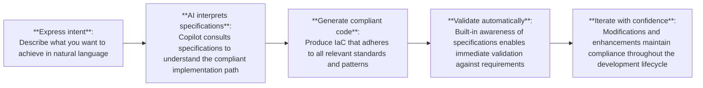

{}

The content in this section represents **experimental explorations** of emerging technologies and innovative approaches. To learn more about our experimental content and its implications, please refer to the [Experimental Section Overview]({}/experimental).

{}

## Overview

Specification-Driven Development (SDD) is a development paradigm where **the specification becomes the single source of truth**, and **code is generated, validated, and continuously regenerated from that specification**. The key idea: you define intent upfront and unambiguously, and both humans and AI agents produce the implementation from it.

In this new model, specifications serve as a **machine-enforceable contract** between:
- **Solution builders** who compose IaC solution templates for their workload's requirements
- **AI assistants** that generate code following these requirements
- **Governance teams** who can trust that deployed infrastructure meets organizational requirements

This contract ensures that as requirements change and as Azure evolves or best practices advance, updates to specifications automatically propagate through AI-assisted development, keeping all solutions aligned with current standards without requiring manual intervention across thousands of code repositories.

## Core Principles

1. **The Specification becomes the system**: SDD flips the traditional hierarchy: instead of writing code and using specs as optional documentation, code now serves the specification, not the other way around. Specs no longer describe the system - they define it.
2. **Architecture becomes executable**: Architecture and requirements aren't advisory; platforms can enforce them, regenerate code, and detect drift via continuous validation and schema checks.
3. **Intent > Implementation**: Human authority shifts "upward," focusing on intent, policy, constraints, and ethics, while automation handles consistent implementation.
4. **Parallelization and consistency**: Because every team consumes the same precise blueprint, SDD eliminates ambiguity and reduces rework.
5. **AI-native development workflow**: AI coding agents (e.g., GitHub Copilot with Spec Kit) rely on specifications to generate architecture plans, tests, tasks, and code in a deterministic, repeatable way.

## Paradigm Shift

Historically, infrastructure development has been an iterative process of trial and error - developers write code, test it, encounter issues, consult documentation, refine the approach, and repeat. This cycle is time-consuming and error-prone, with each developer potentially interpreting best practices differently, leading to inconsistent implementations across teams and projects.

**Specification-driven development** represents a fundamental shift in how we approach infrastructure coding. Rather than developers manually translating requirements into code while attempting to remember and apply countless best practices, the approach leverages **comprehensive, machine-readable specifications** that define exactly how infrastructure should be structured, configured, and implemented.

This paradigm shift elevates the developer's role from code writer to solution architect. Instead of spending time ensuring compliance with specifications manually, developers can:

- **Design at a higher level**: Focus on business requirements and architectural decisions
- **Compose solutions faster**: Leverage pre-validated patterns and modules
- **Maintain quality effortlessly**: Specifications are automatically applied through AI assistance
- **Scale best practices**: Consistent, high-quality implementations across the entire organization

## New Development Workflow

Specification-driven development enabled by AI transforms the traditional workflow into a systematic, compliance-first process:

## How Infrastructure-as-Code (IaC) Changes with SDD

When GitHub Copilot is equipped with specifications, AI doesn't just suggest code - it becomes a **compliance engine** that understands and enforces the intricate rules, patterns, and best practices defined in the specifications. This carries several advantages.

**1. IaC moves from code-first to specification-first**

Today's IaC flow often tries to encode architecture through Bicep/Terraform solution templates. In SDD:
- The infrastructure specification sits above the IaC language.
- IaC (Bicep, Terraform solution templates) becomes generated artifacts.
- Updating infra means updating the specification, and regeneration ensures consistency. Code is "the last-mile expression" of the spec.

This reduces cognitive load as focus shifts from "How do I implement this correctly?" to "What do I want to accomplish?"

**2. Eliminates drift between architecture documents and IaC**

- SDD enforces consistency through continuous schema validation, contract testing, and automated detection of spec-to-code mismatches.
- This means no more documentation vs solution code mismatches: code is always aligned with the specification.

**3. IaC solution templates become generated, not hand-coded**

- Your specification becomes the authoritative source (constraints, principles, etc.).
- Bicep/Terraform solution templates are generated from specs, by referencing AVM modules - removing human variation.
- Quality improves as every parameter, and configuration follows the same high-quality standards
- Refactoring becomes updating specification, not rewriting code
- Template structure, testing, and documentation become deterministic output.
- Developers gain access to expert-level knowledge embedded in the specifications without needing to memorize hundreds of pages of requirements

**4. Stronger governance built-in from day 1**

- Specs can encode: Well-Architected principles, compliance constraints, naming, tagging, and security baselines
- IaC code is generated to comply automatically as SDD encodes governance in specifications, IaC gets governance-first enforcement.

**5. AI agents can automate infra decisions reliably**

"Ad-hoc" AI-generated IaC often lacks correctness or compliance; with SDD:
- Correctness by design is embedded by design, as AI agents use the specifications as guardrails.
- Generated templates follow a deterministic architecture plan, not LLM "best guesses."
- Changes are applied by updating the specification, not patching IaC manually.

This is transformative for large-scale infra modernization.

**6. Cross-organizational alignment becomes much easier**
IaC solution developers work with various teams, often in different organizations - everyone reads specifications differently. SDD solves this as specifications are versioned, reviewable, and auditable, with decisions and trade-offs being stored alongside specifications. This means fewer misinterpretations such as requirement mismatches or lifecycle ambiguities.

**7. Infrastructure testing and validation become automated**

Specifications become the basis for testing, including deployment validations, compliance checks, etc. IaC test automation becomes spec-driven and auto-generated.

## The Future is Specification-Driven

As AI capabilities continue to advance, the value of comprehensive, well-defined specifications only increases. The combination of AVM's rigorous specification framework, the principles of spec-driven development and GitHub Copilot's AI intelligence represents not just an incremental improvement, but a fundamental re-imagining of how cloud infrastructure development can and should work in the AI era.
