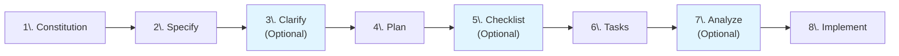

{}

The content in this section represents **experimental exploration** of emerging technologies and innovative approaches. To learn more about our experimental content and its implications, please refer to the [Experimental Section Overview]({}/experimental).

{}

## Prerequisites



    {}

{}

    {}
    {}

{}

    {}



Before you begin, make sure you have these tools installed in your development environment!

## Solution Architecture

Before we begin coding, it is important to have details about what the infrastructure architecture will include. For our example, using AVM modules, we will be building a solution that will host a legacy business application running as a single Windows Server 2016 virtual machine (VM) with at least 2 CPU cores, 8GB RAM, Standard HDD OS disk, and a 500GB data disk.

The VM is accessible via Azure Bastion using secure RDP access (no public IP exposure). The solution needs an Azure Storage Account with an HDD-backed file share connected via private endpoint, and an Azure Key Vault to securely store the VM administrator password generated at deployment time. The VM must not be accessible from the internet, and all diagnostic logs will be captured in a Log Analytics workspace with critical alerts configured for VM availability, disk utilization, and Key Vault access failures.


## Bootstrapping

{}

On a Windows PC, to get the **uv package manager CLI** tool required for locally installing the **Specify CLI**, run the following command:

```bash
winget install astral-sh.uv
```

{}

1. To install [Spec Kit](https://github.com/github/Spec-Kit) locally, run the following command in an elevated terminal:

    ```bash
    uv tool install specify-cli --from git+https://github.com/github/spec-kit.git
    ```

2. Create a new directory for your Spec Kit project and navigate into it - this folder ideally already exists as a git repository:

    ```bash
    mkdir avm-workload
    cd avm-workload
    ```

3. Set your default branch to `main` (initializing Spec Kit will configure this working folder as a git repository if it isn't one already):

    ```bash
    git config --global init.defaultBranch main
    ```

4. Initialize a new Spec Kit project:

    ```bash
    specify init .
    ```

    If the folder has already been set up as a repository, the specify tool will warn you that the folder is not empty. Just confirm that you want to proceed.

    As we haven't defined the AI assistant in our init command, specify will prompt us to choose one. Select **copilot (GitHub Copilot)** from the list. Similarly, as we haven't defined the script type, specify will prompt us to choose one. Select **ps (PowerShell)** from the list.

    Alternatively, you can provide these parameters directly in the init command, like so:

    ```bash
    specify init . --ai copilot --script ps
    ```

    {}

Note: As Spec Kit evolves, the output may change over time. This example is meant to give you an idea of what the user interface looks like.

Click through the tabs to see the details!


{}

You should see something like this:


{}
{}

In your project folder, you should now see the following files and folders created by the specify tool:




{}



    {}

5. Spec Kit automatically commits this step to the git repository with following comment: `Initial commit from Specify template`.

6. The rest of the steps will be performed using GitHub Copilot Chat in VS Code: Start your VS Code environment, open or add the newly created folder to your workspace, and navigate to GitHub Copilot Chat using the dialog icon on the top of the window or by hitting `CTRL+ALT+I`.

## Making it real

Spec Kit follows a structured workflow that guides you through each phase of solution development, from establishing foundational principles to implementing the final code. To learn more about Spec Kit, see the [Spec Kit overview]({}/experimental/ai-assisted-sol-dev/spec-kit) section.



To implement our example solution using AVM modules, we will walk through each of these steps in detail.

Each of the below steps will typically take 3-8 minutes to complete, depending on the complexity of your specification, the performance of the AI model you are using, and your reaction time to answer any outstanding questions and review and approve the generated content.

{}

Changing the LLM does make a difference. We highly encourage you test different models to see which one works best for your needs.

**Note**: At the time of writing this article, we tested our prompts with `Claude Sonnet 4.5`.

{}

{}
1. As Spec Kit uses a set of built-in and system tools and scripts, you will need to approve the execution of each of these steps. **Make sure you understand the impact of these commands before approving and proceeding!**
Here's an example:


2. In some cases, your account might exceed **GitHub's API rate limits** when using GitHub Copilot with Spec Kit. If that happens, please wait for a while (usually an hour or so) and try again.
{}

### 1. Constitution

Spec Kit uses `/speckit.constitution` to generate the `constitution.md` file. The constitution can be evolved through iterating over the `constitution.md` file by either manually editing it or repeatedly fine tuning the prompt used with `/speckit.constitution`.

{}

To learn more about what the constitution should include, see the [Constitution chapter]({}/experimental/ai-assisted-sol-dev/spec-kit#1-constitution) in the Spec Kit article.

{}

{}


{}

Notice what the `constitution.md` file looks like before running the related prompt. It is just a template with placeholders, defining the structure:

Note: As Spec Kit evolves, the content of this template may change over time. This example is meant to give you an idea of what the starting point looks like.





{}


{}

1. Run the following prompt to generate the constitution for our example:



{}

```markdown
/speckit.constitution Fill the constitution with the typical requirements of a legacy Azure workload (needed to be retained for compliance reasons; no high-availability requirements; no disaster recovery requirements; no scalability requirements), defined as infrastructure-as-code, in Bicep language, built only with Azure Verified Modules (AVM). Always try to implement every feature with Bicep first (using Infra-as-code), and only use custom scripts when it's not possible otherwise. Follow IaC best practices: define everything in a single template, and let ARM manage dependencies and the order of deployment for each Azure resource.

Security and reliability best practices must be followed under all circumstances.

The naming convention is to use just enough random characters to make the name unique and have the Azure resource type reflected in the name. Resource type specific character and length limitations must be respected.

Before running a deployment, always run a validation.

Deploy everything to the US West 3 datacenter region.
```
    {}

The most important artifact created in this phase is the `constitution.md` file. Based on your inputs, additional files may also be created or updated, such as `spec-template.md` , `plan-template.md`, and `tasks-template.md`. These would further improve the quality of the generated artifacts in later phases.

Note: You may get different results, depending on a number of factors such as your inputs, LLM of choice, the current state of the Spec Kit, etc. This example is meant to give you an idea of what the outputs of this step typically look like.

Click through the tabs to see the details!


{}

Once Copilot finished running the prompt, you should see something like this in the Copilot chat area:


{}
{}

In the `constitution.md` file, notice, how changes implemented by Copilot are not final yet, until you review, and approve them by clicking on the "Keep" button. You can either do this on a paragraph-by-paragraph basis, or for the entire document at once by clicking on the "Keep" button in the main Copilot chat window.:


{}
{}





{}



    {}

{}
{}

```markdown
/speckit.constitution Fill the constitution with the typical requirements of a legacy Azure workload (needed to be retained for compliance reasons; no high-availability requirements; no disaster recovery requirements; no scalability requirements), defined as infrastructure-as-code, in Terraform language, built only with Azure Verified Modules (AVM). Always try to implement every feature with Terraform first (using Infra-as-code), and only use custom scripts when it's not possible otherwise. Follow IaC best practices: define everything in a single template, and let Terraform manage dependencies and the order of deployment for each Azure resource.

Security and reliability best practices must be followed under all circumstances.

The naming convention is to use just enough random characters to make the name unique and have the Azure resource type reflected in the name. Resource type specific character and length limitations must be respected.

Before running a deployment, always run a validation.

Deploy everything to the US West 3 datacenter region.
```

    {}

The most important artifact created in this phase is the `constitution.md` file. Based on your inputs, additional files may also be created or updated, such as `spec-template.md` , `plan-template.md`, and `tasks-template.md`. These would further improve the quality of the generated artifacts in later phases.

Note: You may get different results, depending on a number of factors such as your inputs, LLM of choice, the current state of the Spec Kit, etc. This example is meant to give you an idea of what the outputs of this step typically look like.

Click through the tabs to see the details!


{}

Once Copilot finished running the prompt, you should see something like this in the Copilot chat area:


{}
{}

In the `constitution.md` file, notice, how changes implemented by Copilot are not final yet, until you review, and approve them by clicking on the "Keep" button. You can either do this on a paragraph-by-paragraph basis, or for the entire document at once by clicking on the "Keep" button in the main Copilot chat window.:


{}
{}





{}



    {}

{}




2. Review and approve all changes suggested by Copilot by clicking on the "Keep" button or tweak them as necessary!
3. It is recommended to make a commit now to capture the new constitution of your project, with a comment of something like `Constitution added`.

### 2. Specify

Spec Kit uses `/speckit.specify` to generate the `spec.md` file. Specifications can be evolved through iterating over the `spec.md` file by either manually editing it or repeatedly fine tuning the prompt used with `/speckit.specify` and leveraging `/speckit.clarify` to review and challenge the specification.

{}

To learn more about what the specification should include, see the [Specification chapter]({}/experimental/ai-assisted-sol-dev/spec-kit#2-specify) in the Spec Kit article.

{}

1. Run the following prompt to generate the specification for our example:



{}

```markdown
/speckit.specify Create specification, called "01-my-legacy-workload" for a legacy business application, running as a single virtual machine connected to a virtual network. The VM must run Windows Server 2016, needs to have at least 2 CPU cores, 8 GB of RAM, a standard HDD, and a 500 GB HDD-based data disk attached. It must be remotely accessible via a bastion host and needs to have access to an HDD-backed file share in a storage account connected via a private endpoint. The VM must access the internet via a NAT gateway. Network Security Groups (NSGs) must be created for each subnet, configured and assigned as applicable, restricting traffic to only what's necessary. VM subnet NSG must allow inbound RDP (port 3389) from Bastion subnet to enable bastion connectivity.

The VM's administrator password (created at the time of deployment) must be stored in a Key Vault, also deployed as part of this solution. The VM's administrator account must be called "vmadmin". The VM's computer name (netbios name) must be 15 or fewer characters long.

Always rely on parameters from the main.bicepparam file only. Have the name of the secret used for the admin password captured as a parameter. Include rich comments in both the main.bicep and main.bicepparam files to explain the purpose of each resource and parameter.

When a decision needs to be made on availability zones, always choose a number between 1 and 3 (never choose -1, that explicitly disables this feature).

Create everything in a single resource group, standing for a production environment. Do not create any additional environments (such as dev, test, staging, etc.).

Read the documentation (readme.md file) of each module you need to use to find out what parameters and complex parameter objects you can use. Don't guess the allowed parameters.

The VM must not be accessible from the internet and its logs should be captured in Log Analytics, included with the solution. Configure diagnostic logging plus critical-only alerts (VM stopped, disk full, Key Vault access failures).
```

    {}

Notice that the execution of the /speckit.specify created a new file called `requirements.md` and a file called `spec.md` in the `specs/001-legacy-vm-workload/` folder.

Note: You may get different results, depending on a number of factors such as your inputs, LLM of choice, the current state of the Spec Kit, etc. This example is meant to give you an idea of what the outputs of this step typically look like.

Click through the tabs to see the details!


{}

Once Copilot finished running the prompt, you should see something like this in the Copilot chat area:


{}
{}





{}
{}





{}



    {}

{}
{}

```markdown
/speckit.specify Create specification, called "01-my-legacy-workload" for a legacy business application, running as a single virtual machine connected to a virtual network. The VM must run Windows Server 2016, needs to have at least 2 CPU cores, 8 GB of RAM, a standard HDD, and a 500 GB HDD-based data disk attached. It must be remotely accessible via a bastion host and needs to have access to an HDD-backed file share in a storage account connected via a private endpoint. The VM must access the internet via a NAT gateway. Network Security Groups (NSGs) must be created for each subnet, configured and assigned as applicable, restricting traffic to only what's necessary. VM subnet NSG must allow inbound RDP (port 3389) from Bastion subnet to enable bastion connectivity.

The VM's administrator password (created at the time of deployment) must be stored in a Key Vault, also deployed as part of this solution. The VM's administrator account must be called "vmadmin". The VM's computer name (netbios name) must be 15 or fewer characters long.

Always rely on values from the `terraform.tfvars` file only. Have the name of the secret used for the admin password captured as a variable. Include rich comments in both the `main.tf` and `terraform.tfvars` files to explain the purpose of each resource and variable.

When a decision needs to be made on availability zones, always choose a number between 1 and 3 (never choose -1, that explicitly disables this feature).

Create everything in a single resource group, standing for a production environment. Do not create any additional environments (such as dev, test, staging, etc.).

Read the documentation (readme.md file) of each module you need to use to find out what variables and complex variable objects you can use. Don't guess the allowed variables.

The VM must not be accessible from the internet and its logs should be captured in Log Analytics, included with the solution. Configure diagnostic logging plus critical-only alerts (VM stopped, disk full, Key Vault access failures).
```

    {}

Notice that the execution of the /speckit.specify created a new file called `requirements.md` and a file called `spec.md` in the `specs/001-legacy-vm-workload/` folder.

Note: You may get different results, depending on a number of factors such as your inputs, LLM of choice, the current state of the Spec Kit, etc. This example is meant to give you an idea of what the outputs of this step typically look like.

Click through the tabs to see the details!


{}

Once Copilot finished running the prompt, you should see something like this in the Copilot chat area:


{}
{}





{}
{}





{}



    {}
{}



2. Review and approve all changes suggested by Copilot by clicking on the "Keep" button or tweak them as necessary!
3. It is recommended to make a commit now to capture the clarified specification of your project, with a comment of something like `Specification created`.

### 3. Clarify (Optional)

Spec Kit uses `/speckit.clarify` to generate adjust information captured in `spec.md`. The prompt doesn't require any specific inputs as it analyzes the existing specification for gaps.

{}

To learn more about the clarify step, see the [Clarify chapter]({}/experimental/ai-assisted-sol-dev/spec-kit#3-clarify-optional) in the Spec Kit article.

{}

1. Run the following prompt to generate clarification questions for our example:



{}

```markdown
/speckit.clarify
```

{}

The clarify phase iterates on the spec.md file by asking questions, making suggestions and capturing the user's feedback.

Note: You may get different results, depending on a number of factors such as your inputs, LLM of choice, the current state of the Spec Kit, etc. This example is meant to give you an idea of what the outputs of this step typically look like.

Click through the tabs to see the details!


{}

When running the clarify prompt, Copilot may ask you a number of depth questions to clarify certain aspects of the plan. Here's an example of what that looks like. You can answer in the following format, e.g.: `Q1: E, Q2:A, Q3:A`


{}
{}

In the Copilot chat window, you will likely see some questions raised, similar to these. You can answer these just like in a normal chat conversation - e.g., by typing the letter standing for the option provided for each question, or by elaborating further if needed.


{}
{}

See a few examples of clarifying questions Copilot may ask. Copilot typically suggests a few options, but you can always deviate from them as needed, just use the chat to provide your answers.

```md
## Clarifications

- Q: How should the Azure file share be mounted on the Windows VM? → A: Post-deployment manual mount by administrator following documented procedure (no automation, aligns with IaC-first principle)
- Q: What level of monitoring and alerting should be configured for this legacy workload? → A: Diagnostic logging plus critical-only alerts (VM stopped, disk full, Key Vault access failures)
- Q: If the initial deployment partially fails (e.g., VM creates but Bastion fails), what should the recovery procedure be? → A: Keep existing resources, fix errors in template/parameters, redeploy entire template (ARM incremental mode handles already-deployed resources)
- Q: File share initial quota and growth strategy? → A: 1TB initial quota with documented growth monitoring procedure
- Q: VM administrator username? → A: vmadmin
- Q: VNet address space and subnet sizing for VM, bastion, and private endpoint subnets? → A: VNet: 10.0.0.0/24, VM subnet: 10.0.0.0/27, Bastion subnet: 10.0.0.64/26, Private endpoint subnet: 10.0.0.128/27
- Q: Storage file share quota size? → A: 1024 GiB (1 TiB)
- Q: Disk space alert threshold percentage? → A: 85% full
- Q: Alert notification method for critical alerts? → A: Azure Portal notifications only
- Q: VM size SKU for 2 cores and 8GB RAM requirement? → A: Standard_D2s_v3
```

{}


    {}

{}
{}

```markdown
/speckit.clarify
```

{}

The clarify phase iterates on the spec.md file by asking questions, making suggestions and capturing the user's feedback.

Note: You may get different results, depending on a number of factors such as your inputs, LLM of choice, the current state of the Spec Kit, etc. This example is meant to give you an idea of what the outputs of this step typically look like.

Click through the tabs to see the details!


{}

When running the clarify prompt, Copilot may ask you a number of depth questions to clarify certain aspects of the plan. Here's an example of what that looks like. You can answer in the following format, e.g.: `Q1: E, Q2:A, Q3:A`


{}
{}

In the Copilot chat window, you will likely see some questions raised, similar to these. You can answer these just like in a normal chat conversation - e.g., by typing the letter standing for the option provided for each question, or by elaborating further if needed.


{}
{}

See a few examples of clarifying questions Copilot may ask. Copilot typically suggests a few options, but you can always deviate from them as needed, just use the chat to provide your answers.

```md
## Clarifications

- Q: Backup & Recovery Strategy - Does the legacy workload require Azure Backup for VM and data disk? → A: No backups needed - VM and data disk are disposable, can be recreated from Terraform
- Q: VNet Address Space and Subnet Sizing - What specific CIDR allocations should be used for the 3 required subnets? → A: Minimal: 10.0.0.0/24 (VM: /27, Bastion: /26, PrivateEndpoint: /28) - tight fit, no growth
- Q: VM Size SKU Selection - Which specific Azure VM SKU should be used for the 2-core/8GB requirement? → A: Standard_D2s_v3 (General Purpose) - balanced, widely used, predictable performance
- Q: Azure Files Share Quota and Performance Tier - What provisioned capacity should the file share have? → A: 1TB Standard tier (LRS) - large capacity for growth
- Q: Log Analytics Workspace Retention Period - How long should diagnostic logs be retained? → A: 180 days retention - extended compliance coverage, moderate cost increase
- Q: How should the Azure file share be mounted on the Windows VM? → A: Post-deployment manual mount by administrator following documented procedure (no automation, aligns with IaC-first principle)
- Q: What level of monitoring and alerting should be configured for this legacy workload? → A: Diagnostic logging plus critical-only alerts (VM stopped, disk full, Key Vault access failures)
- Q: If the initial deployment partially fails (e.g., VM creates but Bastion fails), what should the recovery procedure be? → A: Keep existing resources, fix errors in template/parameters, redeploy entire template (ARM incremental mode handles already-deployed resources)
- Q: VM administrator username? → A: vmadmin
- Q: VNet address space and subnet sizing for VM, bastion, and private endpoint subnets? → A: VNet: 10.0.0.0/24, VM subnet: 10.0.0.0/27, Bastion subnet: 10.0.0.64/26, Private endpoint subnet: 10.0.0.128/27
- Q: Disk space alert threshold percentage? → A: 85% full
- Q: Alert notification method for critical alerts? → A: Azure Portal notifications only
```

{}


    {}

{}



2. Review and approve the changes suggested by Copilot by clicking on the "Keep" button!
3. It is recommended to make a commit now to capture the updated specification of your project, with a comment of something like `Specification clarified`.

### 4. Plan

Spec Kit uses `/speckit.plan` to generate the `plan.md` file. The plan can be evolved through iterating over the `plan.md` file by either manually editing it or repeatedly fine tuning the prompt used with `/speckit.plan`, or leveraging `/speckit.checklist` to review/validate and challenge the plan.

{}

To learn more about what the plan should include, see the [Plan chapter]({}/experimental/ai-assisted-sol-dev/spec-kit#4-plan) in the Spec Kit article.

Click through the tabs to see the details!

{}

1. Run the following prompt to generate the plan for our example:



{}

```markdown
/speckit.plan Create a detailed plan for the spec. Build with the latest version of Bicep and the latest available version of each AVM module. Use the "Bicep/list_avm_metadata" MCP tool to find out what's the latest version of each module. Only include direct resource references in the Bicep template if no related AVM resource modules are available. Similarly, for diagnostic settings, role assignments, resource locks, tags, managed identities, private endpoints, customer manged keys, etc., always use the related "interface" built-in to each resource module when available. Do not create and reference local modules, or any other bicep files. If a subset of the deployments fail, don't delete anything, just attempt redeploying the whole solution after fixing any bugs. Create a single main.bicep file, with direct references to AVM modules and leverage a single *.bicepparam file for all input parameters.

When generating the admin password for the VM, use the secret feature built into the AVM Key Vault module. Leverage the uniqueString function to generate a new random password and do not use any external helper script (including deployment scripts) for generating the password. Provide this password to the VM module by referencing the Key vault secret that stores it. The template must first generate this password including a random, complex string, using the uniqueString Bicep function, store it in Key Vault and then reference it for the VM to use it as admin password at deployment time.

Don't connect the file share to the VM just yet - i.e., no need to extract storage keys or shared access signatures - we will do this later.

If implementing resource level locks, always use the built-in AVM "interface" for resource locks, instead of directly deploying the "Microsoft.Authorization/locks" resource.

Bicep template must compile without warnings or errors using the latest stable Bicep CLI version. Create a bicepconfig.json file to generate a warning when not the latest version of an AVM module is used. You can configure this by making sure in the bicepconfig.json file, there is a node under analyzers/core/rules/use-recent-module-versions/level" with the value of "warning". Before validating the template or attempting the first deployment, always fix all warnings or errors related to the AVM module versioning by updating to the latest available version of each module.
```

    {}

Notice how the plan step creates the `plan.md` file and a number of additional helper files. These may very depending on your prompts, the solution you are building, the version of Spec Kit and the LLM used. These typically include: `data-model.md`, `research.md`, `quickstart.md` and optional files in the contracts folder, such as `outputs.md` and `parameters.md`.

Note: You may get different results, depending on a number of factors such as your inputs, LLM of choice, the current state of the Spec Kit, etc. This example is meant to give you an idea of what the outputs of this step typically look like.

Click through the tabs to see the details!


{}

In the Copilot chat window, you should see results, similar to this:


{}
{}





{}
{}





{}

{}





{}

{}





{}



    {}

{}
{}

```markdown
/speckit.plan Create a detailed plan for the spec. Build with the latest version of Terraform and the latest available version of each AVM module. Use the Terraform MCP server to find out what's the latest version of each module. Only include direct resource references in the Terraform solution template (root module) if no related AVM resource modules are available. Similarly, for diagnostic settings, role assignments, resource locks, tags, managed identities, private endpoints, customer manged keys, etc., always use the related "interface" built-in to each resource module when available. Do not create and reference local modules, or any other Terraform files. If a subset of the deployments fail, don't delete anything, just attempt redeploying the whole solution after fixing any bugs. Follow Terraform best practices to create these files: `terraform.tf` - to hold the provider definitions and versions. `variables.tf` - to contain the input variable definitions and defaults. `outputs.tf` - to contain the outputs and their descriptions for use by any external modules calling this root module. `main.tf` - to contain the core module code for creating the solutions infrastructure. `terraform.tfvars` - to contain the inputs for the instance of the module that is being deployed. Content in this file will vary from instance to instance.

When generating the admin password for the VM, use the secret feature built into the AVM Key Vault module. Leverage the random_password resource in the random provider to generate a new random password and do not use any external helper script (including deployment scripts) for generating the password. Provide this password to the VM module by referencing the Key vault secret that stores it. The solution template (root module) must first generate this password including a random, complex string, using the random_password Terraform resource, store it in Key Vault and then reference it for the VM to use it as admin password at deployment time.

Don't connect the file share to the VM just yet - i.e., no need to extract storage keys or shared access signatures - we will do this later.

If implementing resource level locks, always use the built-in AVM "interface" for resource locks, instead of directly deploying the "Microsoft.Authorization/locks" resource.

Terraform solution template (root module) must validate without warnings or errors using the latest stable Terraform CLI version. Generate a warning when not the latest version of an AVM module is used. Before validating the solution template (root module) or attempting the first deployment, always fix all warnings or errors related to the AVM module versioning by updating to the latest available version of each module.
```

{}



2. Review and approve all changes suggested by Copilot by clicking on the "Keep" button or tweak them as necessary!
3. It is recommended to make a commit now to capture the changes in your project, with a comment of something like `Plan created`.

### 5. Checklist (Optional)

Spec Kit uses `/speckit.checklist` to validate the requirements. The prompt doesn't require any specific inputs as it analyzes the existing plan for gaps.

{}

To learn more about the checklist step, see the [Checklist chapter]({}/experimental/ai-assisted-sol-dev/spec-kit#5-checklist-optional) in the Spec Kit article.

{}

1. Run the following prompt to generate checklist items for our example:



{}

```markdown
/speckit.checklist
```

    {}

Note: You may get different results, depending on a number of factors such as your inputs, LLM of choice, the current state of the Spec Kit, etc. This example is meant to give you an idea of what the outputs of this step typically look like.

Click through the tabs to see the details!


{}

When running the checklist prompt, Copilot may ask you a number of depth questions to clarify certain aspects of the plan. Here's an example of what that looks like. You can answer in the following format, e.g.: `Q1: E, Q2:A, Q3:A`


{}
{}

In the Copilot chat window, you should see results, similar to this:


{}
{}





{}



    {}

{}
{}

Coming soon!

{}



2. Review and approve all changes suggested by Copilot by clicking on the "Keep" button or tweak them as necessary!
3. It is recommended to make a commit now to capture your new checklist, with a comment of something like `Checklist prepared`.

### 6. Tasks

Spec Kit uses `/speckit.tasks` to generate the `tasks.md` file. The prompt doesn't require any specific inputs as it analyzes the existing plan to break it down into actionable tasks. Tasks can be evolved through iterating over the `tasks.md` file by either manually editing it or repeatedly fine tuning the prompt used with `/speckit.tasks`, or leveraging `/speckit.analyze` to review/validate and challenge the tasks.

{}

To learn more about what the tasks should include, see the [Tasks chapter]({}/experimental/ai-assisted-sol-dev/spec-kit#6-tasks) in the Spec Kit article.

{}

1. Run the following prompt to generate tasks for our example:



{}

```markdown
/speckit.tasks
```

    {}

Note: You may get different results, depending on a number of factors such as your inputs, LLM of choice, the current state of the Spec Kit, etc. This example is meant to give you an idea of what the outputs of this step typically look like.

Click through the tabs to see the details!


{}

In the Copilot chat window, you should see something like this:


{}
{}





{}


    {}

{}
{}

Coming soon!

{}



2. Review and approve all changes suggested by Copilot by clicking on the "Keep" button or tweak them as necessary!
3. It is recommended to make a commit now to capture your task list, with a comment of something like `Tasks generated`.

### 7. Analyze (Optional)

Spec Kit uses `/speckit.analyze` to generate an analysis report. The prompt doesn't require any specific inputs as it analyzes the existing spec, plan and tasks to produce the report.

{}

To learn more about the analyze step, see the [Analyze chapter]({}/experimental/ai-assisted-sol-dev/spec-kit#7-analyze-optional) in the Spec Kit article.

{}

1. Run the following prompt to generate an analysis report for our example:



{}

```markdown
/speckit.analyze
```

    {}

Note: You may get different results, depending on a number of factors such as your inputs, LLM of choice, the current state of the Spec Kit, etc. This example is meant to give you an idea of what the outputs of this step typically look like.

Click through the tabs to see the details!


{}

In the Copilot chat window, you should see something like this:


{}
{}





{}


    {}

{}
{}

Coming soon!

{}



2. Review and approve all changes suggested by Copilot by clicking on the "Keep" button or tweak them as necessary!
3. It is recommended to make a commit now to capture your analysis report, with a comment of something like `Analysis report generated`.

### 8. Implement

Spec Kit uses `/speckit.implement` to generate the solution template file along with its parameters file. The prompt doesn't require any specific inputs as it analyzes the existing plan and tasks to generate the implementation code.

{}

To learn more about the implement step, see the [Implement chapter]({}/experimental/ai-assisted-sol-dev/spec-kit#8-implement) in the Spec Kit article.

{}

1. Run the following prompt to generate the implementation for our example:



{}

```markdown
/speckit.implement
```

    {}

During the Implement phase, Copilot acts based on the `tasks.md` file (checkboxes next to each completed task get marked with `[X]`). It validates all previously created checklists, such as the `implementation-readiness.md`, `requirements.md` files. As a result of this prompt execution, a number of files get generated, such as:`main.bicep`, `main.bicepparam`, `bicepconfig.json`, `.gitignore`

Note: You may get different results, depending on a number of factors such as your inputs, LLM of choice, the current state of the Spec Kit, etc. This example is meant to give you an idea of what the outputs of this step typically look like.

Click through the tabs to see the details!


{}

{}

{}

{}

{}

{}

{}



{}

{}



{}

{}

{}


    {}

{}
{}

Coming soon!

{}



2. Review and approve all changes suggested by Copilot by clicking on the "Keep" button or tweak them as necessary!
3. It is recommended to make a commit now to capture your implementation results, with a comment of something like `Implementation complete`.

## Next Steps

Congratulations! You've walked through a complete Spec Kit workflow for building Azure infrastructure using Azure Verified Modules. By following this structured approach, you've created a deployable IaC solution that is:

- **Well-documented**: Every design decision is captured in the specification and plan.
- **Secure by default**: The constitution enforces security baselines from the start.
- **Reproducible**: The generated IaC template can be deployed consistently across environments.
- **Maintainable**: Clear task breakdowns and checklists make future updates straightforward.

From here, you can ask Copilot to help you with the deployment and further enhancements, or you can manually take the following steps to deploy and manage your solution:



    {}

1. **Validate with What-If**: Run `az deployment group what-if` to preview changes before deployment.
2. **Deploy to Azure**: Use the Azure CLI or Bicep CLI to deploy your generated `main.bicep` to a subscription:
    ```bash
    az deployment group create \
      --resource-group <your-resource-group> \
      --template-file main.bicep \
      --parameters main.bicepparam
    ```
4. **Integrate into CI/CD**: Add the generated templates to your Azure DevOps or GitHub Actions pipelines.
5. **Extend the solution**: Iterate on the specification to add new capabilities while maintaining alignment with your constitution.

    {}
    {}

Coming soon!

    {}



For more information on Spec Kit and the underlying methodology, see the [Spec Kit overview]({}/experimental/ai-assisted-sol-dev/spec-kit) or explore the [Specification-Driven Development]({}/experimental/ai-assisted-sol-dev/sdd) concepts.
